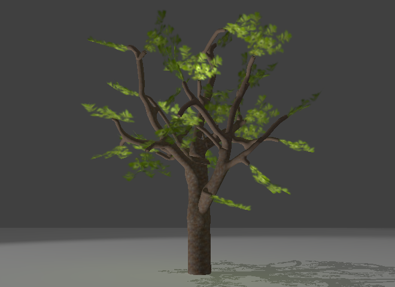
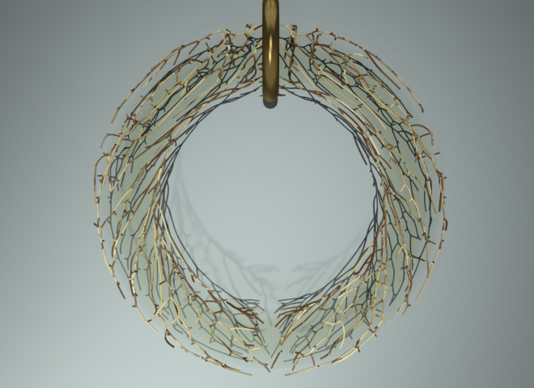

# spacetree-sverchok

2020-07-21 added a scripted node lite that works with Sverchok 0.6 and Blender 2.83

space colonization algorithm (tree generator) implemented as scripted node for sverchok

see http://elfnor.com/

